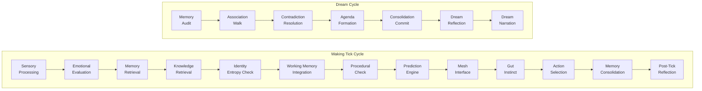

# LegionIO

### What if your AI agent had a brain — not just a prompt?

**73 extension gems. 234 cognitive modules. 23,000+ specs. One Ruby framework.**

```bash
gem install legionio
```

---

## See It in Action

<!-- TODO: Replace with asciinema embed or gif after recording (Task 2 from catalyst plan) -->

```
$ legion start
  Loading 73 extensions... done
  Tick cycle: 13 phases active
  Dream cycle: standby
  API: http://localhost:4567
  Ready.

$ legion chat
  You: Tell me about yourself
  Agent: I'm a LegionIO cognitive agent. I have memory that fades,
         predictions that adapt, and I dream during idle periods
         to consolidate what I've learned. What would you like
         to explore?
```

*45 seconds from install to your first conversation with an agent that thinks.*

---

## Start Here

Pick your path — each one gets you to an "aha" moment in 15 minutes or less.

| You are... | Start with... | Time |
|:-----------|:-------------|:-----|
| **An AI/agent builder** | [Cognitive Agent Quickstart]() | 15 min |
| **A Ruby developer** | [Extension Dev Quickstart]() | 10 min |
| **An LLM power user** | [Multi-Provider Routing Guide]() | 10 min |
| **Evaluating for enterprise** | [Enterprise Overview]() | 5 min read |
| **Ready to contribute** | [Contributing Guide](https://github.com/LegionIO/.github/blob/main/CONTRIBUTING.md) | 5 min read |

---

## The Cognitive Stack

Every LegionIO agent runs a **tick cycle** — a 13-phase cognitive loop modeled on biological neural processing. Each tick, the agent perceives, remembers, predicts, decides, acts, and reflects. During idle periods, a 7-phase **dream cycle** consolidates and reorganizes memory.



234 cognitive modules across 13 domain gems — memory, emotion, attention, inference, social cognition, metacognition, imagination, and more. Every module is optional, composable, and independently removable.

[Architecture Overview]() | [Philosophy]()

---

## Community

- [GitHub Discussions](https://github.com/LegionIO/docs/discussions) — questions, ideas, architecture talk
- [Slack](https://legionio.slack.com) — real-time chat
- [Philosophy]() — understand our design principles before contributing
- [Extension Catalog]() — browse all 73 extensions

---

## Quick Install

```bash
# Homebrew (recommended)
brew tap LegionIO/tap
brew install legionio

# Or RubyGems
gem install legionio

# Start the engine
legion start

# Or just chat
legion chat
```

**Requirements:** Ruby >= 3.4, RabbitMQ. Optional: PostgreSQL/MySQL/SQLite, Redis/Memcached, HashiCorp Vault.

---

**License:** Core framework [Apache-2.0](https://www.apache.org/licenses/LICENSE-2.0) | Extensions [MIT](https://opensource.org/licenses/MIT)

*Too lazy for prompts. Built a brain instead.*
