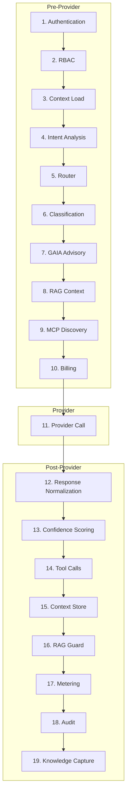

# The LLM Pipeline

Most agent frameworks call the model and hope for the best. LegionIO runs every LLM call through a 19-step pipeline that enforces access control, classifies sensitive data, injects relevant knowledge, guards budgets, dispatches tools, scores confidence, and captures what was learned — before the response reaches the caller.

The pipeline is enabled by default. Every `Legion::LLM.chat(message:)` call routes through it.

---

## Why a Pipeline?

When you call an LLM in production, you need more than inference. You need:

- **Who is calling?** RBAC enforcement based on caller identity.
- **What are they sending?** PII/PHI classification before the data leaves your network.
- **What does the agent already know?** RAG context from the Apollo knowledge store.
- **Can they afford it?** Budget enforcement and cost estimation before the call.
- **Was the response faithful?** Post-generation RAG guard checks.
- **What did we learn?** Knowledge capture writes synthesis back to Apollo.
- **What happened?** Full audit trail with distributed tracing.

Most frameworks make you build this yourself. LegionIO ships it.

---

## The 19 Steps



### Step 1: Authentication

Verify caller identity. Extracts principal from JWT, API key, or Kerberos ticket.

### Step 2: RBAC

Enforce role-based access control via `legion-rbac`. Checks caller permissions against the requested operation. Gracefully degrades when RBAC is not loaded — the pipeline never hard-fails on a missing optional component.

### Step 3: Context Load

Load conversation history from the `ConversationStore`. In-memory LRU hot layer (256 conversations) with optional database persistence via Sequel.

### Step 4: Intent Analysis

Classify request intent and complexity. Feeds into the router for tier selection.

### Step 5: Router

Select provider, model, and tier based on routing rules. The router evaluates rules in priority order with intent matching, schedule windows, cost multipliers, and health-aware circuit breakers.

Three tiers:
- **Local** — Ollama or on-device models (fast, free, air-gapped)
- **Fleet** — shared inference servers via AMQP dispatch
- **Cloud** — commercial APIs (Anthropic, OpenAI, Bedrock, Gemini, Azure AI, xAI)

Escalation is automatic: if the selected model fails or produces low-quality output, the router walks up the `EscalationChain` to the next capable model.

### Step 6: Classification

Scan request content for PII and PHI patterns (SSN, email, phone, MRN, DOB). Classification levels only upgrade, never downgrade. Auto-enables when a compliance profile is active (`compliance.classification_level` is set).

### Step 7: GAIA Advisory

Pre-flight enrichment from the cognitive layer. When GAIA is running, the pipeline asks for relevant context from the current tick state — emotional valence, prediction state, working memory. This is what makes LegionIO responses contextually aware without prompt engineering.

### Step 8: RAG Context

Retrieve relevant knowledge from Apollo. Strategy selector chooses between full, hybrid, and compact RAG based on context window utilization:

- **Low utilization** — full RAG (room for context)
- **Medium utilization** — compact RAG (summarized chunks)
- **High utilization** — skip RAG (preserve space for the response)

Trivial queries (greetings, pings) skip RAG automatically. All thresholds are configurable.

### Step 9: MCP Discovery

Discover available tools from all healthy MCP servers via the `Legion::MCP::Client::Pool`. Aggregates tool lists across registered servers with TTL caching.

### Step 10: Billing

Budget enforcement via `CostEstimator`. Estimates request cost before the call. Rejects the request if the session budget would be exceeded. Budget is configurable per session (`llm.budget.session_usd`).

### Step 11: Provider Call

Execute LLM inference via the selected provider. Supports streaming — pre/post steps run normally, chunks are yielded to the caller. Multi-turn conversations inject prior messages via `session.add_message` before the final ask.

### Step 12: Response Normalization

Normalize provider-specific response format into a unified `Pipeline::Response` struct with content, tool calls, stop reason, model, and token counts.

### Step 13: Confidence Scoring

Score response quality using three sources in priority order:

1. **Caller-provided** — explicit confidence score passed in the request
2. **Model-native logprobs** — when the model returns token probabilities
3. **Heuristic analysis** — refusal detection, truncation detection, repetition scoring, hedging language penalties, structured output bonus

Scores map to bands: very_low (0-0.3), low (0.3-0.5), medium (0.5-0.7), high (0.7-0.9), very_high (0.9-1.0). Band boundaries are configurable.

### Step 14: Tool Calls

Dispatch non-builtin tool calls from the LLM response. The `ToolDispatcher` routes each call to the right handler:

- **MCP client** — external tool servers
- **LEX extension runner** — internal extension functions
- **RubyLLM builtin** — framework-provided tools

### Step 15: Context Store

Persist conversation state back to the `ConversationStore` for future context loading.

### Step 16: RAG Guard

Post-generation faithfulness check against retrieved RAG context. Uses `lex-eval` evaluators (faithfulness, RAG relevancy) with a configurable threshold (default 0.7). Metadata is attached to the response without blocking.

### Step 17: Metering

Record token usage, provider, model, and status. Publishes metering events for cost tracking and chargeback. Auto-cost tracking records per-request cost via `CostTracker`.

### Step 18: Audit

Publish audit event to the `llm.audit` exchange with full distributed tracing (trace_id, span_id, exchange_id). The audit event includes the complete pipeline timeline with participant tracking.

### Step 19: Knowledge Capture

Write research synthesis back to Apollo. When the pipeline produces a substantive response to a knowledge query, the content is ingested into both local and global Apollo stores — tagged with the model and conversation context. Over time, the agent builds a knowledge base from its own work.

---

## Caller Profiles

Not all LLM calls need full governance. The pipeline uses caller profiles to skip irrelevant steps:

| Profile | Who | Steps Skipped |
|:--------|:----|:-------------|
| **external** | User-facing requests | None — full pipeline |
| **gaia** | Cognitive layer (tick phases, dream cycle) | RBAC, classification, billing |
| **system** | Internal framework calls | Most steps — auth and provider only |

Profiles are derived from the `caller:` parameter. GAIA phases pass their identity automatically.

---

## Configuration

The pipeline is configured via `~/.legionio/settings/llm.json`:

```json
{
  "llm": {
    "pipeline_enabled": true,
    "routing": {
      "enabled": true,
      "tiers": ["cost_optimized"],
      "health": {
        "probe_interval_seconds": 30
      }
    },
    "rag": {
      "full_limit": 10,
      "compact_limit": 5,
      "min_confidence": 0.3
    },
    "confidence": {
      "bands": {
        "low": 0.3,
        "medium": 0.5,
        "high": 0.7,
        "very_high": 0.9
      }
    },
    "budget": {
      "session_usd": 5.0
    },
    "cost_tracking": {
      "auto": true
    },
    "metering": {
      "auto": true
    }
  }
}
```

Set `pipeline_enabled: false` to bypass the pipeline entirely and route directly to the provider. Individual steps degrade gracefully when their backing subsystems (RBAC, Apollo, GAIA) are not loaded.

---

## Streaming

The pipeline supports streaming. Pre-provider steps run normally, then chunks are yielded to the caller as they arrive from the provider. Post-provider steps run after the stream completes.

```ruby
Legion::LLM.chat(message: "Explain event sourcing") do |chunk|
  print chunk.content
end
```

---

## Error Handling

The pipeline uses a typed error hierarchy with `retryable?` predicates:

| Error | Retryable | Meaning |
|:------|:----------|:--------|
| `AuthError` | No | Authentication or RBAC failure |
| `RateLimitError` | Yes | Provider rate limit (429) |
| `ContextOverflow` | No | Input exceeds model context window |
| `ProviderError` | Yes | Transient provider failure |
| `ProviderDown` | Yes | Provider circuit breaker tripped |
| `UnsupportedCapability` | No | Model lacks required capability |
| `PipelineError` | No | Internal pipeline failure |

Retryable errors trigger automatic escalation to the next model in the `EscalationChain`.

---

## What's Next

- [Architecture Overview]() — understand the full system context
- [Settings Reference]() — every LLM pipeline configuration key
- [Enterprise Overview]() — compliance, audit, and cost recovery
